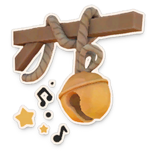
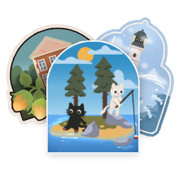
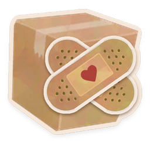
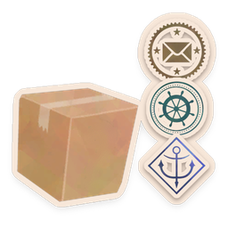
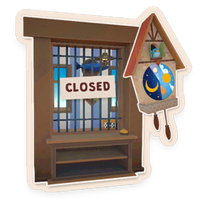

# CatLib

Foundation library for modding **Cat Mail Co.** with BepInEx 6 (Unity IL2CPP), and the gameplay mods built on it.

[](https://store.steampowered.com/app/4380490/Cat_Mail_Co/)
[](https://thunderstore.io/c/cat-mail-co/p/CatLib/CatLib/)
[](https://thunderstore.io/c/cat-mail-co/p/CatLib/CatLib/)
[](https://github.com/BepInEx/BepInEx)
[](https://unity.com)
[](LICENSE)

> [!TIP]
> **Just want to play?** Install the mods from [Thunderstore](https://thunderstore.io/c/cat-mail-co/) with a mod manager:
> it brings CatLib and everything else they need. Every mod below has a page that says what it does and who in a lobby needs it.

## Mods

| | Mod | What it does | Who needs it | Thunderstore |
|:-:|---|---|---|:-:|
|  | [Boat Tweaks](mods/BoatTweaks/README.md) | Crates and baskets on the boat deck, stack height limits | everyone | [](https://thunderstore.io/c/cat-mail-co/p/CatLib/BoatTweaks/) |
|  | [Shelf Labels](mods/ShelfLabels/README.md) | Up to three extra labels next to every shelf label, stored per save | everyone | [](https://thunderstore.io/c/cat-mail-co/p/CatLib/ShelfLabels/) |
|  | [Better Repair](mods/BetterRepair/README.md) | Cardboard of the repair table: unlimited, a larger stock, what a new day brings | everyone | [](https://thunderstore.io/c/cat-mail-co/p/CatLib/BetterRepair/) |
|  | [Parcel Board](mods/ParcelBoard/README.md) | Counts of the parcels in the level by destination, mark and size | only you | [](https://thunderstore.io/c/cat-mail-co/p/CatLib/ParcelBoard/) |
|  | [Stack it!](mods/StackIt/README.md) | Parcels that stand across the joint of level parcels and fall when one is taken away | everyone | [](https://thunderstore.io/c/cat-mail-co/p/CatLib/StackIt/) |
|  | [Too Late](mods/TooLate/README.md) | Joining a game in progress, up to 8 players | only the host | [](https://thunderstore.io/c/cat-mail-co/p/CatLib/TooLate/) |

"Everyone" mods are paused for the whole lobby while someone does not have them, instead of breaking the game.

The packages the mods stand on:

| Package | What it is | Thunderstore |
|---|---|:-:|
| [CatLib](CHANGELOG.md) | The library itself: the Mods tab, translations, the lobby check and everything mods use | [](https://thunderstore.io/c/cat-mail-co/p/CatLib/CatLib/) |
| [CatLib Crash Watcher](tools/CatLib.CrashWatcher/README.md) | The crash window and reports, installed together with CatLib | [](https://thunderstore.io/c/cat-mail-co/p/CatLib/CrashWatcher/) |
| [CatLib Tests](tests/CatLib.Tests/README.md) | In-game tests and the developer menu, for mod authors only | [](https://thunderstore.io/c/cat-mail-co/p/CatLib/CatLibTests/) |

## What CatLib gives

<table>
<tr>
<td width="50%" valign="top">

**For players**

- a **Mods tab** in the game's settings, with every mod's icon, description and settings that apply at once
- every text in **all 13 languages** of the game, fixable with a small file
- the **players' mods in the lobby**, with paused mods instead of disconnects
- a **crash window** with a report to send, also for freezes while quitting
- mod data kept **next to your saves**, never inside them

</td>
<td width="50%" valign="top">

**For mod authors**

- live **settings** with no UI code, host values in multiplayer
- **translations** from `Lang/*.json`, plural forms, checks
- **multiplayer**: compatibility check, roster, paused mods, messages between mods
- **game data**: events, parcels, storage grids, the game build
- **patching** that is all or nothing, **HUD** tables, a **developer menu**
- **Thunderstore packages** from one build command

</td>
</tr>
</table>

## Documentation

Start with **[Writing a mod](docs/WritingMods.md)**, then pick what your mod needs. The [documentation index](docs/README.md) has the same list with the main types of every page.

| Topic | Page | In short |
|---|---|---|
| Start | [Writing a mod](docs/WritingMods.md) | From an empty project to a Thunderstore package |
| | [Core helpers](docs/Basics.md) | Logging, the frame loop, the main thread, game info, the game build |
| Settings and texts | [Live settings](docs/Settings.md) | `CatSettings`: settings that apply at once and show up on the Mods tab |
| | [Localization](docs/Localization.md) | `Lang/*.json`, plural forms, translation files of players |
| Multiplayer | [Multiplayer compatibility](docs/Network.md) | Policies, the handshake, session settings, the roster, mod messages |
| Game | [Game events](docs/GameEvents.md) | The game's events as .NET events, and the order they really come in |
| | [Storages](docs/Storages.md) | How the game stacks parcels, `StoreGrid` |
| | [HUD and parcels](docs/Hud.md) | `CatParcels`, `HudLayer`, `CountTable`, `CountList` |
| | [Patching the game](docs/Patching.md) | `CatPatches` and `CodePatch` |
| Data | [Mod data in game saves](docs/Saves.md) | `CatSaves`: data per save, written with the game's save |
| UI | [Folding lists](docs/Foldout.md) | `FoldoutList`, a list built from the game's own UI |
| Tools | [Developer menu](docs/DevTools.md) | One in-game panel for developer commands |
| | [Crash reports](docs/CrashReports.md) | The crash watcher, reports and memory dumps; its insides in [its own README](tools/CatLib.CrashWatcher/README.md) |
| Project | [Changelog](CHANGELOG.md) · [Roadmap](ROADMAP.md) · [Deferred tests](tests/DeferredTests.md) · [Tests and developer tools](tests/CatLib.Tests/README.md) | |

## Building

1. Install the .NET SDK 8 or newer.
2. Install BepInEx 6 (IL2CPP) into the game and start the game once, so `BepInEx/interop` is generated.
3. Copy `GamePaths.props.example` to `GamePaths.props` and set `GameDir` to the folder with the game executable.
4. Run `dotnet build` in the repository root.

Every build copies each plugin into its own folder in `BepInEx/plugins`: `CatLib`, `CatLib.Tests` and one folder per mod.

| Option | Effect |
|---|---|
| `-p:CatLibDeploy=false` | build without copying into the game |
| `-p:CatLibThunderstore=true` | also pack every project with `Thunderstore/manifest.json` into `Thunderstore-build/`, see [Thunderstore package](docs/WritingMods.md#thunderstore-package) |
| `SecondGameDir` in `GamePaths.props` | copy the plugins into a second copy of the game too, for two players on one computer |

> [!NOTE]
> `CatLib.CrashWatcher.exe` is built for .NET Framework 4.8, which every Windows 10 and 11 has, and goes into the `CatLib` folder next to `CatLib.dll`.
> For players it is its own Thunderstore package, `CatLib-CrashWatcher`, which CatLib depends on; CatLib finds it next to itself or in any folder of `BepInEx/plugins`.

> [!IMPORTANT]
> When the game updates and CatLib is checked with the new build, add the new game version (`GameVersion` in the log)
> and the Steam build to `GameCompatibility.Supported` in `src/CatLib/Game/GameCompatibility.cs` before the release.
> Keep an older build in the list only while CatLib still works with it.

## Tests

`CatLib.Tests` runs about 160 tests inside the real game the first time the main menu loads, and again from the developer menu.
Reports go to `BepInEx/CatLib.Tests/Reports`, timelines of game events to `BepInEx/CatLib.Tests/Timelines`.
Its developer menu commands and settings are in **[Tests and developer tools](tests/CatLib.Tests/README.md)**.
Checks that wait for something we do not have yet are in [Deferred tests](tests/DeferredTests.md).

<details>
<summary><b>Repository layout</b></summary>

```
CatLib.sln
Directory.Build.props        shared compiler settings and game path resolution
Directory.Build.targets      imports everything in build/
GamePaths.props.example      template for your local game path
build/
  GameReferences.targets     references to BepInEx core and generated interop assemblies
  PluginMeta.targets         generates PluginMeta (Guid, Name, Version) from the project file
  Lang.targets               embeds Lang/*.json of every project
  Deploy.targets             copies the built plugin into BepInEx/plugins/<folder>
  Thunderstore.targets       packs a project into Thunderstore-build/ with -p:CatLibThunderstore=true
src/CatLib/                  the library, shipped to players
tools/CatLib.CrashWatcher/   the crash window, its own package CatLib-CrashWatcher, see its README
mods/                        gameplay mods built on CatLib, one project per mod
tests/CatLib.Tests/          in-game tests and developer tools, for developers only
docs/                        documentation
```

</details>

<details>
<summary><b>Namespaces</b></summary>

| Namespace | Purpose |
|---|---|
| `CatLib` | Plugin entry point, `PluginMeta` |
| `CatLib.Core` | Runtime bootstrap, `FrameLoop` for per-frame updates |
| `CatLib.Logging` | `CatLogger`, scoped logging on top of BepInEx |
| `CatLib.Threading` | `MainThread` dispatcher |
| `CatLib.Events` | `SafeInvoker`, events whose handlers cannot break each other |
| `CatLib.Il2Cpp` | Binding managed code to IL2CPP events; `Il2CppArrays` for two-dimensional IL2CPP arrays that interop cannot type |
| `CatLib.Patching` | `CatPatches`, Harmony patches installed whole or not at all; `CodePatch`, checked changes of a few bytes of game code |
| `CatLib.Game` | `GameInfo`, `GameCompatibility`, `CatParcels`, `StoreGrid` |
| `CatLib.Game.Events` | The game's events as plain .NET events, `GameEventStream` |
| `CatLib.Game.Bridge` | Tracks game singletons and binds their events |
| `CatLib.Config` | Live settings: `CatSettings`, `Setting<T>`, `CatConfig` |
| `CatLib.Saves` | `CatSaves`, mod data per game save |
| `CatLib.Localization` | Translation catalogs, `CatLanguage` follows the game language |
| `CatLib.Diagnostics` | The crash watcher's session file and reports |
| `CatLib.DevTools` | Developer menu, `DevMenu.Command` and `DevMenu.Toggle` |
| `CatLib.UI` | Mods tab, `Notifications`, `HudLayer`, `CountTable`, `CountList`, `FoldoutList`, the lobby list, the version label |
| `CatLib.Net` | `CatNetwork`: compatibility check, session settings, roster, `Channel` for messages between mods |

</details>

<details>
<summary><b>How the mods in this repository are built</b></summary>

Each mod in `mods/` is its own BepInEx plugin, released separately from CatLib:

- it has a `BepInDependency` on `catlib.core`;
- it declares its network policy with `CatNetwork.Declare`;
- its project file only sets the GUID, name, version and deploy folder; everything else comes from the shared build files;
- all mods keep [the same folder layout](docs/WritingMods.md#folders).

</details>

## Conventions

- No comments in code.
- Log messages are in English.
- Numbers and dates in logs and reports use the invariant culture.
- One public type per file, the folder structure mirrors the namespaces.

## License

MIT, see [LICENSE](LICENSE).
