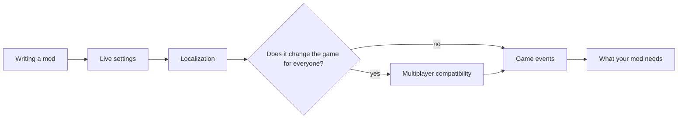

# CatLib documentation

For mod authors. Players find what each mod does in its own README, linked from the [main page](../README.md#mods).

## Where to start

1. **[Writing a mod](WritingMods.md)** — the project, the plugin class, the folders, releasing.
2. **[Live settings](Settings.md)** and **[Localization](Localization.md)** — every mod has both.
3. **[Multiplayer compatibility](Network.md)** — read it before writing anything that changes the game for other players.
4. Then the pages your mod needs, below.

## All pages

| Page | What it covers | Main types |
|---|---|---|
| [Writing a mod](WritingMods.md) | Project, plugin, folders, lessons about game objects, Thunderstore packages | `PluginMeta` |
| [Core helpers](Basics.md) | Logging, every frame, the main thread, safe events, game state, the game build, notifications, 2D arrays | `CatLogger`, `FrameLoop`, `MainThread`, `SafeInvoker`, `GameInfo`, `GameCompatibility`, `Notifications`, `Il2CppArrays` |
| [Live settings](Settings.md) | Settings that apply at once, scopes, restart-only settings, the Mods tab | `CatSettings`, `Setting<T>`, `CatConfig` |
| [Localization](Localization.md) | `Lang/*.json`, plural forms, the game language, translation files of players, checks | `CatLocalization`, `CatLanguage`, `TranslationCheck` |
| [Multiplayer compatibility](Network.md) | Policies, the handshake, session role and settings, the roster, paused mods, mod messages, the Steam channel | `CatNetwork`, `ModChannel`, `SessionRoster` |
| [Mod data in game saves](Saves.md) | Data per save, when it is written, safety rules | `CatSaves` |
| [Game events](GameEvents.md) | The game's events as .NET events, who receives what, the real order | `BootstrapEvents`, `PlayerEvents`, `NetworkEvents`, `SaveEvents`, `GameEventStream` |
| [Storages](Storages.md) | How the game stacks parcels, grids, placing, marks | `StoreGrid`, `GridView` |
| [HUD and parcels](Hud.md) | The parcels of the level, drawing on the screen during a level | `CatParcels`, `ParcelInfo`, `HudLayer`, `CountTable`, `CountList` |
| [Patching the game](Patching.md) | Harmony patches all or nothing, errors in handlers, changing bytes of game code | `CatPatches`, `CodePatch`, `BytePattern` |
| [Folding lists](Foldout.md) | A list built from the game's own UI pieces | `FoldoutList`, `FoldoutStyle` |
| [Developer menu](DevTools.md) | One in-game panel for developer commands | `DevMenu` |
| [Crash reports](CrashReports.md) | The crash window, reports, memory dumps, settings | — |

More: [Tests and developer tools](../tests/CatLib.Tests/README.md) · [Changelog](../CHANGELOG.md) · [Roadmap](../ROADMAP.md)

## How these pages are written

- Every page starts with what the feature is for, then the code, then the rules and the edge cases.
- Tables list members and behaviour; code blocks are complete enough to copy.
- Notes marked **Important**, **Warning** or **Caution** are things that broke a mod before.
- Behaviour of the game is written as observed, with the game version it was observed on.
