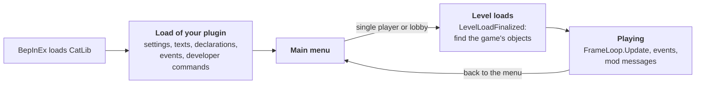

# Writing a mod

This guide walks through a gameplay mod built on CatLib, from an empty project to a Thunderstore package.
Every mod in [`mods/`](../mods) follows it; [Better Repair](../mods/BetterRepair/README.md) is the smallest complete one,
[Boat Tweaks](../mods/BoatTweaks/README.md) and [Too Late](../mods/TooLate/README.md) show the harder parts.

> [!NOTE]
> You need the .NET SDK 8, the game with BepInEx 6 (IL2CPP) started once so `BepInEx/interop` exists,
> and this repository built once as described in [Building](../README.md#building).

## The short way

1. Copy `mods/BetterRepair` to `mods/MyMod` and rename the project, the namespace and the plugin class.
2. Set the GUID, name, version and deploy folder in the project file ([Project](#project)).
3. Write the texts into `Lang/en.json` ([Texts](#texts)) and declare settings ([Settings](#settings)).
4. Declare how the mod behaves in multiplayer ([Plugin](#plugin)).
5. `dotnet sln add mods/MyMod/MyMod.csproj`, `dotnet build`, start the game: the mod is on the Mods tab.
6. Before a release: a 256x256 `icon.png`, `README.md`, `CHANGELOG.md`, `Thunderstore/` ([Thunderstore package](#thunderstore-package)).

## What runs when



- `Load` runs once per game start. Declare everything there; the game's objects do not exist yet.
- Every return to the main menu is a full restart of the game's managers. A mod builds its state again on every level,
  usually in `BootstrapEvents.LevelLoadFinalized`, and lets it go in `GameRestartStarted`.

## Project

A mod in this repository lives in `mods/<Name>/` and only declares what is its own:

```xml
<Project Sdk="Microsoft.NET.Sdk">
  <PropertyGroup>
    <AssemblyName>MyMod</AssemblyName>
    <RootNamespace>MyMod</RootNamespace>
    <Version>0.1.0</Version>
    <PluginGuid>catlib.mymod</PluginGuid>
    <PluginMetaName>My Mod</PluginMetaName>
    <CatLibDeployFolder>MyMod</CatLibDeployFolder>
  </PropertyGroup>

  <ItemGroup>
    <ProjectReference Include="..\..\src\CatLib\CatLib.csproj" Private="false" />
  </ItemGroup>
</Project>
```

The shared build files add the game and BepInEx references, the generated `PluginMeta` class (`Guid`, `Name`, `Version`),
the texts in `Lang/*.json` and the copy into `BepInEx/plugins/<CatLibDeployFolder>`.

> [!TIP]
> A mod outside this repository references `CatLib.dll` from the game's `BepInEx/plugins` directly, with `Private="false"`,
> and writes its own `BepInPlugin` values instead of `PluginMeta`.

### Icon

Put a 256x256 `icon.png` with a transparent background into `mods/<Name>/`, the same file Thunderstore needs.
The build copies it next to the mod's DLL, and the Mods tab shows it next to the mod's name and on its card.

| Situation | Result |
|---|---|
| no `icon.png` | warning CATLIB001, a question mark on the Mods tab |
| an icon that is not 256x256 | a warning in the log line `[Icons]` |
| `CatLibIcon` in the project | the icon is taken from that path |
| `CatLibIconCheck` set to `false` | no check |
| `settings.IconPath` in code | another file at run time |

CatLib looks for `icon.png` next to the DLL and up to two folders above it, but never in the shared `plugins` folder,
so the layout of a package installed by a mod manager works too.

The **author** under the version comes from the Thunderstore package folder (`Author-ModName`) when a mod manager installed the mod,
otherwise from `Authors` in the project file; `settings.Author` sets it from code.
The **description** on the card is `mod.description` of the catalog in the player's language, else `description`
of the Thunderstore `manifest.json`; `settings.Description` sets it from code.

### Folders

Every mod in this repository keeps the same layout. The namespace follows the folder, for example `BoatTweaks.Logic`.

```
mods/<Name>/
  <Name>Plugin.cs     entry point: declarations, settings, events, developer commands
  <Name>Controller.cs ties the parts together while the game runs
  <Name>.csproj
  README.md           what the mod does, settings, how it works, for GitHub
  CHANGELOG.md        changes per version, for GitHub and the Thunderstore package
  icon.png            256x256, for the Mods tab and the Thunderstore package
  Thunderstore/       manifest.json and README.md of the Thunderstore package
  Lang/               en.json, ru.json and other languages
  Settings/           the mod's settings
  Logic/              rules, plans and state without game objects; covered by offline tests
  Scene/              code that reads or changes game objects
  Sync/               multiplayer: mod messages and shared state
  Data/               mod data in game saves
  Patches/            Harmony patches
```

A folder appears only when the mod needs it. Code that can live in `Logic` goes there,
so most of the mod is tested without starting the game.

## Plugin

```csharp
[BepInPlugin(PluginMeta.Guid, PluginMeta.Name, PluginMeta.Version)]
[BepInDependency("catlib.core")]
public sealed class MyModPlugin : BasePlugin
{
    public override void Load()
    {
        var log = CatLogger.From(Log);
        var settings = CatSettings.For(this);
        CatNetwork.Declare(this, SessionPolicy.RequiredOnAll);

        var controller = new MyController(log, settings);
        BootstrapEvents.LevelLoadFinalized += controller.OnLevelReady;
        BootstrapEvents.GameRestartStarted += controller.OnRestart;
        FrameLoop.Update += controller.Update;
    }
}
```

| Line | Why |
|---|---|
| `BepInDependency("catlib.core")` | BepInEx loads CatLib first |
| `CatSettings.For(this)` | your settings, and the texts from `Lang/*.json` with the players' translation files |
| `CatNetwork.Declare` | puts the mod into the multiplayer check |
| `FrameLoop.Update` | every frame on the main thread; an exception in one handler does not stop the others |

Which policy to declare:

| The mod… | Policy | Example |
|---|---|---|
| changes rules or objects every player sees | `RequiredOnAll` | Stack it!, Boat Tweaks |
| changes only what the host's game decides | `HostOnly` | Too Late |
| only shows something to its own player | `ClientOnly` | Parcel Board |

A `RequiredOnAll` mod is paused while a player does not have it, so check `CatNetwork.IsActive(this)` before acting.
Details: [Multiplayer compatibility](Network.md).

## Settings

```csharp
var stock = settings.Session("Cardboard", "Stock", 5, "How many sheets the table holds.", new AcceptableValueRange<int>(1, 20));
stock.Apply(value => controller.SetStock(value));
```

- `Local` settings belong to each player, `Session` settings take the host's value in multiplayer.
- `Apply` runs at once and after every change, from the menu, the file or code, always on the main thread.
- They appear on the Mods tab without any UI code: toggles, sliders, dropdowns, text fields. Details: [Live settings](Settings.md).

## Texts

Every text a player sees comes from the mod's catalog: the name on the Mods tab, sections, labels, descriptions,
dropdown values and the mod's own messages. Put `Lang/en.json` and a file for every other language next to the project;
the build embeds them and CatLib loads them by itself.

```json
{
  "mod": { "name": "My Mod", "description": "What the mod does, in one or two sentences." },
  "section": { "Cardboard": "Cardboard" },
  "setting": {
    "Cardboard.Stock": "Stock",
    "Cardboard.Stock.description": "How many sheets the table holds."
  },
  "message": { "saved": "Saved: {0}" },
  "parcels": { "one": "{0} parcel", "other": "{0} parcels" }
}
```

```csharp
Notifications.Show(settings.Texts.Format("message.saved", name));
Notifications.Show(settings.Texts.Plural("parcels", count));
```

Key rules, plural forms, translation files of players and the checks are in [Localization](Localization.md).

## Finding your way

| I want to… | Use | Page |
|---|---|---|
| log, run code every frame, get to the main thread | `CatLogger`, `FrameLoop`, `MainThread` | [Core helpers](Basics.md) |
| react to the menu, levels, players, saves | `BootstrapEvents`, `PlayerEvents`, `NetworkEvents`, `SaveEvents` | [Game events](GameEvents.md) |
| keep data per save | `CatSaves` | [Mod data in game saves](Saves.md) |
| make the same decision on every player | `CatNetwork.IsAuthority`, a hidden session setting | [Session role](Network.md#session-role) |
| let a player ask the host for something | `CatNetwork.Channel` | [Mod messages](Network.md#mod-messages) |
| list the parcels of the level | `CatParcels` | [HUD and parcels](Hud.md) |
| draw a table on the screen during a level | `HudLayer`, `CountTable` | [HUD and parcels](Hud.md) |
| read shelf and parcel grids | `StoreGrid` | [Storages](Storages.md) |
| change what a game method does | `CatPatches` | [Patching the game](Patching.md) |
| change a number compiled into a game method | `CodePatch` | [Patching the game](Patching.md#changing-a-few-bytes-of-the-games-code) |
| show a list built from the game's UI | `FoldoutList` | [Folding lists](Foldout.md) |
| add tools for myself | `DevMenu.Command` | [Developer menu](DevTools.md) |
| stay off on an untested game build | `GameCompatibility` | [Core helpers](Basics.md#game-build) |

## Multiplayer in three rules

1. Decisions that must be the same for everyone are made where `CatNetwork.IsAuthority` is true
   (single player and the host) and reach the other players in a hidden session setting or a mod message.
2. A player acts on such a value only when `IsOverridden` is true, that is after the host accepted it.
3. Random choices are sent as a seed, and every player rebuilds the same result from it.

The pattern with code is in [Session role](Network.md#session-role).
For actions of players, such as a click on an object the mod added, use [mod messages](Network.md#mod-messages):
the player asks the host, the host checks and applies the action and tells everyone the result.

## Working with game objects

Lessons from the mods so far:

> [!WARNING]
> **Managers are recreated.** Every `Singleton<T>` of the game is destroyed and created again on each level load and restart.
> Keep the pointer of the instance you worked with and redo the work when `Singleton<T>.Instance` changes; never keep game objects across levels.

> [!CAUTION]
> **Create objects only inside the object that owns them.** Objects created in one scene and left alive while that scene unloads
> corrupt Unity's scene lists and crash the game later. Destroy temporary objects right away.

- **Change prefabs for what comes next, instances for what exists now.** The game builds new objects from prefabs,
  so a value written to a prefab reaches every future copy. Remember the original value and write it back when the mod is turned off.
- **Read fields, not computed properties.** Auto properties of game classes are backed by fields named `_Name_k__BackingField`;
  reading those never runs game code. Computed getters may.
- **Two-dimensional arrays** such as `bool[,]` come through interop as a bare `Il2CppObjectBase`.
  Read them with [`Il2CppArrays`](Basics.md#two-dimensional-arrays).
- **Some state is read once.** The boat storage, for example, finds its blocked cells when it is created and never again,
  so a mod that adds blockers later has to keep those cells taken itself. When a change seems to be ignored, measure what the game reads and when.
- **Not every machine runs the same code.** Some game logic runs only on the host (`Gameplay.*` events, parcel registration,
  damage checks). Test on a client too: [Game events](GameEvents.md#who-receives-what) lists who receives what.

## Finding things in the game

`CatLib.Tests` has developer commands for research ([list](../tests/CatLib.Tests/README.md#developer-menu)):

1. **Inspect → Entity dump** writes what the camera looks at, with its components, fields and object tree,
   and the nearest objects of the game types in `EntityDumpTypes`.
2. Take a dump with a screenshot of the same view, change one thing in the game, take another dump and compare.
3. **Sprite export** and **Texture export** write the game's UI pictures as PNG, to reuse the game's own look.

## Tests

In this repository a mod's logic is tested in `tests/CatLib.Tests/Suites/<Mod>/`. The tests run in the game when the main menu
loads and from the developer menu, see [Tests and developer tools](../tests/CatLib.Tests/README.md#writing-a-test).
Keep the game-independent parts — parsing, planning, generation — in classes without Unity types so they are easy to test,
and check each rule once with a deliberately broken implementation to see that the test catches it.

## Releasing

- Follow semantic versioning for the mod's `Version`. The default network rule `SameMinor` treats a minor bump as incompatible,
  so players in one lobby need the same minor version; content goes into minor versions, fixes into patch versions.
- Describe settings, modes and multiplayer behaviour in the mod's `README.md`, and the changes of every version in `CHANGELOG.md`.
- Write `Thunderstore/README.md` for players: what the mod does and who in a lobby needs it, no code.

### Thunderstore package

`dotnet build -c Release -p:CatLibThunderstore=true` packs every project that has `Thunderstore/manifest.json`
into `Thunderstore-build/<name>/` and `Thunderstore-build/<name>-<version>.zip`, the file to upload:

```
manifest.json      from Thunderstore/manifest.json
icon.png           the project's icon.png
README.md          from Thunderstore/, written for players
CHANGELOG.md       the project's CHANGELOG.md, when there is one
plugins/<Name>.dll
```

Every other file in `Thunderstore/` goes to the root of the package as well. A mod manager installs the package
into `BepInEx/plugins/<Team>-<name>/`, where CatLib finds the icon and the author.
`Thunderstore-build/` is not in git, and each build replaces the package folder.

`manifest.json` is written with placeholders:

| Placeholder | Becomes |
|---|---|
| `{version}` | the project's `Version` |
| `{catlib_version}` | the version of CatLib the mod is built against |
| `{version:<Project>}` | the version of a referenced project, for example `{version:BoatTweaks}` in the package of `CatLib.Tests` |

```json
{
  "name": "MyMod",
  "version_number": "{version}",
  "website_url": "https://github.com/you/MyMod",
  "description": "What the mod does, 250 characters at most.",
  "dependencies": [
    "CatLib-CatLib-{catlib_version}"
  ]
}
```

`CatLib-CatLib` is the team and the name of [CatLib on Thunderstore](https://thunderstore.io/c/cat-mail-co/p/CatLib/CatLib/).
Depend on CatLib only: it depends on BepInEx and on the [crash watcher](https://thunderstore.io/c/cat-mail-co/p/CatLib/CrashWatcher/) itself.

The build checks the package the way Thunderstore does:

| Code | When | Result |
|---|---|---|
| CATLIB004 | a name with characters other than `a-z A-Z 0-9 _`, a version that is not `Major.Minor.Patch`, a description over 250 characters, no `website_url` (it may be empty), a dependency that is not `Team-Package-1.2.3`, an icon that is not a 256x256 PNG, a placeholder that names no referenced project | error |
| CATLIB002 | no `Thunderstore/README.md` | error |
| CATLIB003 | an empty `Thunderstore/README.md`, a `TODO` left in the manifest, a version that differs from the project, a changelog that does not start with the package version | warning |

Thunderstore shows the README and the changelog on the package page, where links relative to the repository do not open.
The build turns them into links to the repository on GitHub, from `CatLibRepositoryUrl` and `CatLibRepositoryBranch` in `Directory.Build.props`,
so `[Crash reports](docs/CrashReports.md)` in the root changelog becomes `https://github.com/okatodev/CatLib/blob/main/docs/CrashReports.md`.
The files in the repository keep their relative links.

> [!IMPORTANT]
> The changelog must start with a section named after the package version. `## Not released yet` gives warning CATLIB003,
> so rename it when the version is set.

<details>
<summary>More build properties</summary>

| Property or item | Does |
|---|---|
| `CatLibThunderstoreDir` | the output folder |
| `CatLibThunderstoreSource` | the template folder instead of `Thunderstore/` |
| `CatLibThunderstoreChangelog` | another changelog |
| `CatLibThunderstoreFile` | adds a file to `plugins/` |
| `CatLibThunderstoreProject` | adds the output of another project to `plugins/` |

`CatLib.CrashWatcher.exe` is not added to CatLib this way: it has a package of its own.

</details>
