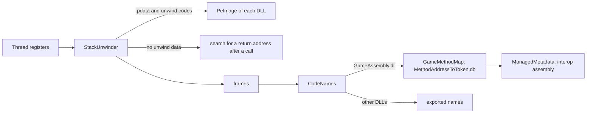

# CatLib Crash Watcher

[](https://thunderstore.io/c/cat-mail-co/p/CatLib/CrashWatcher/)

A small Windows program that waits for the game to close and, when it crashed or froze while quitting,
shows a window with what happened and keeps a report. What players see and what the report holds is in [Crash reports](../../docs/CrashReports.md).

It is its own package, `CatLib-CrashWatcher`, with its own version and [changelog](CHANGELOG.md):
a release of CatLib does not change it, and CatLib depends on it, so a mod manager installs both.

## How it is started

CatLib starts it once per game start from [`CrashWatch`](../../src/CatLib/Diagnostics/CrashWatch.cs):

```
CatLib.CrashWatcher.exe --pid <game process id> --session "<BepInEx/CatLib/Crashes/session_<pid>.txt>" [--dump]
```

| Argument | Meaning |
|---|---|
| `--pid` | the game process to watch |
| `--session` | the session file CatLib writes while the game runs; the report folder is created next to it |
| `--dump` | follow the game as a debugger and write memory dumps (`CrashDumps` in CatLib's config) |
| `--preview` | show the window for a session file without a game, to check texts and layout |

CatLib looks for the program next to `CatLib.dll`, then in every folder of `BepInEx/plugins` up to 4 levels deep, and takes the newest.

## Parts

### Watching

| File | Does |
|---|---|
| `Program.cs` | reads the arguments, waits for the game, writes the report, shows the window |
| `GameDebugger.cs` | follows the game like a debugger: lets handled exceptions through, reads the stacks and writes the dump of an unhandled one, keeps an early dump of native faults, continues breakpoints |
| `HangWatcher.cs` | notices a game that still runs 8 s after it began to quit, reads the stacks of every thread and dumps them |
| `GameProcess.cs` | the exit code and times of the game process |
| `CrashEvents.cs` | the Windows event log records of the crash and of .NET |
| `ReportWriter.cs` | the report folder: `report.txt`, `stacks.txt`, the logs, the session, the dump |
| `CrashWindow.cs`, `ClipboardText.cs` | the window and copying the report |
| `WatcherLog.cs` | `BepInEx/CatLib/Crashes/watcher.log`, the watcher's own log |

### Stacks and names



| File | Does |
|---|---|
| `Stacks/ThreadStacks.cs` | lists the threads of the game, reads their registers and names, pauses them for a hang, formats every frame |
| `Stacks/StackUnwinder.cs` | x64 unwinding like `RtlVirtualUnwind`: prolog and epilog, frame pointer, chained parts, machine frames; a search of the stack where there is no unwind data, with a step back when the found address leads nowhere |
| `Stacks/LiveProcessMemory.cs` | reads the game's memory and whether an address is executable code |
| `Symbols/PeImage.cs` | reads a DLL from disk: sections, `.pdata`, exports, .NET metadata |
| `Symbols/GameMethodMap.cs` | reads `BepInEx/interop/MethodAddressToToken.db` of BepInEx: addresses of the game's methods and their interop methods |
| `Symbols/ManagedMetadata.cs` | reads names, generic parameters and parameter types of methods from an interop assembly, with the original names interop kept |
| `Symbols/CodeNames.cs` | turns a module and an offset into a name, checks that the method map belongs to the running `GameAssembly.dll` |

Nothing here runs while the game plays: the files are read after a crash or a hang. `StackUnwindTest` of `CatLib.Tests` checks
the unwinding and the names on a small x64 image it builds itself, with the method map pointing at its own methods.

### Shared with CatLib

The texts of the session file, the report and the exit codes are shared with CatLib: `CrashText.cs`, `CrashSession.cs`,
`CrashStrings.cs` and `CrashThreadStack.cs` in `src/CatLib/Diagnostics` are compiled into both.

## Building

It is a `WinExe` for .NET Framework 4.8, which every Windows 10 and 11 has. `CatLib.csproj` references it, so a build of CatLib
builds it too, and with a game folder set it is deployed into `BepInEx/plugins/CatLib` next to `CatLib.dll`.
`-p:CatLibWatcherCheck=true` builds it for .NET 8 instead,
to compile and test it on a machine without the .NET Framework reference assemblies.

> [!WARNING]
> The watcher is a debugger of the game. Everything it does while the game is stopped at an exception must be quick,
> and it must never stop the game for good: a breakpoint that is not the first one is continued, because Steam and other
> libraries stop on breakpoints only while a debugger follows them.

## Checking it

The **Crash** group of the developer menu of `CatLib.Tests` crashes or hangs the game on purpose, see
[Tests and developer tools](../../tests/CatLib.Tests/README.md#from-catlibtests). To look at the window without a crash:

```
CatLib.CrashWatcher.exe --preview --session <any session file>
```
